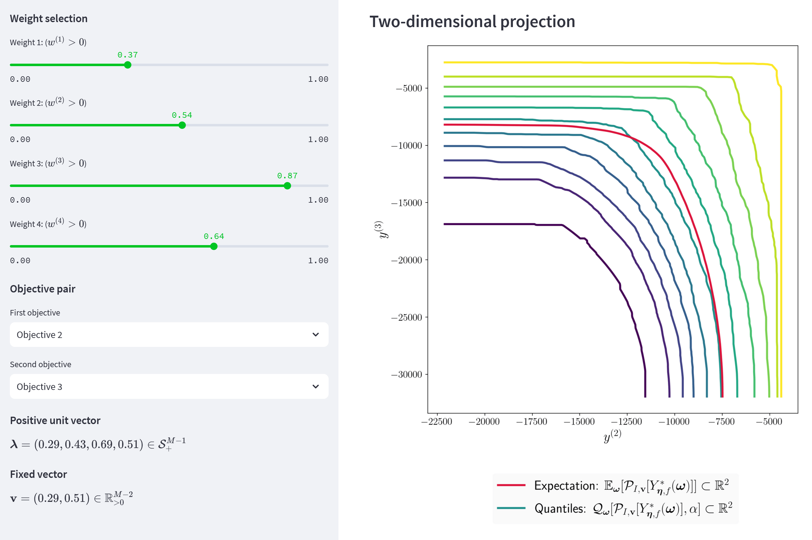

# Visualize

This directory contains the streamlit apps for Pareto front visualization. For these applications to work, the steamlit package must be installed.

**One-dimensional projection.** The one-dimensional projection app can be run using the command: `streamlit run projection_one.py`.

**Two-dimensional projection.** The two-dimensional projection app can be run using the command: `streamlit run projection_two.py`.

**Data.** Internally, both of these streamlit applications are loading data from a synthetic benchmark problem (`python get_data.py`). In particular, the data set is .pt file, `data = torch.load("data.pt")`, containing a python dictionary with one key `Y`. The value of this key, `data["Y"]`, is a torch.Tensor with shape `(num_samples, num_points, num_objectives)`. Naturally, one can easily edit these apps in order to use a different data source instead.
